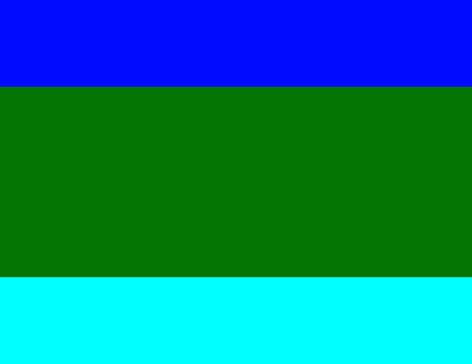
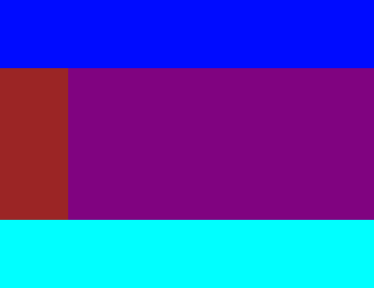
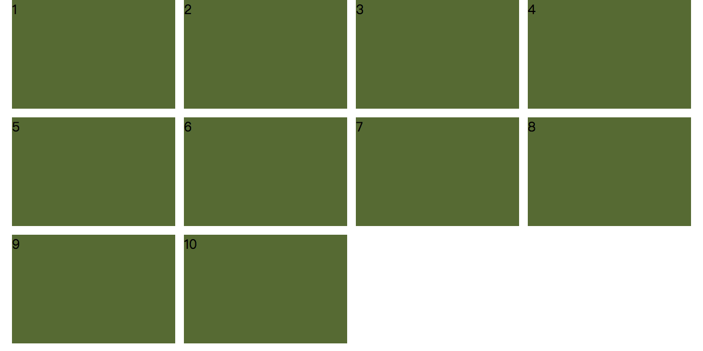

## 项目中常见页面布局的实现

### 整体页面布局

> 最常见的整体页面布局就是上中下，中间部分自适应，再或者就是左右布局，右边自适应。以上中下布局为例，看一下传统方式的实现：

上中下布局：



基础 demo1（以下实现以该 demo 为基础）：

```html
<body>
  <div class="wrap">
    <div class="top"></div>
    <div class="mid"></div>
    <div class="bottom"></div>
  </div>
</body>
```

```css
/* 基础样式 */
html,
body,
.wrap {
  height: 100%;
}
.top {
  background-color: blue;
}
.mid {
  background-color: green;
}
.bottom {
  background-color: aqua;
}
.top,
.bottom {
  height: 200px;
}
```

position 方式实现：

```css
.wrap {
  position: relative;
}
.top {
  position: absolute;
  top: 0;
  width: 100%;
}
.mid {
  position: absolute;
  top: 200px;
  bottom: 200px;
  width: 100%;
}
.bottom {
  position: absolute;
  bottom: 0;
  width: 100%;
}
```

margin、padding 方式实现：

```css
.wrap {
  box-sizing: border-box;
  padding-top: 200px;
  padding-bottom: 200px;
}
.top {
  margin-top: -200px;
}
.mid {
  height: 100%;
}
.bottom {
  margin-bottom: -200px;
}
```

> 传统方式的实现存在这样的问题，自适应的过程中，头部和底部的高度可能会发生变化，就不能和中间部分恰好衔接，出现重叠或者空白。否则通过 js 监听高度变化，同步更改中间的 css 样式。`flex` 方式不仅能够更简单地实现自适应布局，且不存在这些问题，优化页面布局。

flex 方式实现：

```css
.wrap {
  display: flex;
  flex-direction: column;
}
.top {
  flex: none;
}
.mid {
  flex: auto;
  height: 100px;
}
.bottom {
  flex: none;
}
```

> `flex` 方式实现时，头部和底部的高度发生变化时，中间自适应区域会自动发生变化，即是再添加一行标签，也不需要改动其他区域，扩展性更强。自适应区域需要添加`height`属性，设置任意的值，如果没有该属性，在部分版本的 chrome 浏览器中，当自适应区域的子容器设置`height：100%`失效。

> 除了 `flex` 方式，我们还可以使用 `grid` 实现同样的效果，使用更为简单。

grid 方式实现：

```css
.wrap {
  display: grid;
  grid-template-rows: auto 1fr auto;
}
```

> `flex` 和 `grid` 区别在于，`flex` 是一维的弹性布局，`grid` 是二维的弹性布局，`flex` 针对于单行和单列的情况。常见的上中下布局中，中间又会有左右布局，即多行多列，可以通过 `grid` 实现。

多行多列布局：



基础 demo2（以下实现以该 demo 为基础）：

```html
<div class="wrap">
  <div class="top"></div>
  <div class="left"></div>
  <div class="right"></div>
  <div class="bottom"></div>
</div>
```

```css
/* 基础样式 */
html,
body {
  margin: 0;
  height: 100%;
}
.wrap {
  height: 100%;
}
.top {
  background-color: blue;
}
.bottom {
  background-color: aqua;
}
.top,
.bottom {
  height: 200px;
}
.left {
  width: 200px;
  background-color: brown;
}
.right {
  background-color: darkmagenta;
}
```

grid 方式实现：

```css
.wrap {
  display: grid;
  grid-template-rows: auto 1fr auto;
  grid-template-columns: auto 1fr;
}
.top {
  grid-column: 1/3;
}
.bottom {
  grid-column: 1/3;
}
```

### 卡片列表布局

> 卡片列表布局分为两种，在页面自适应过程中，卡片之间间隔固定不变，每行尽可能排列更多的卡片，剩余空间由卡片和容器之间的间隔平分，容器中的卡片整体居中;另一种就是卡片之间的间隔在自适应过程中发生变化，平分剩余空间，同时每行也尽可能排列更多的卡片。



> 实现这两种卡片列表布局传统方式是通过 js 计算，监听页面大小变化，调整容器和卡片或者卡片之间的间隔。现在可以完全通过 `grid` 实现这两种卡片列表布局，使用简单，效果更好。

基础 demo3（以下实现以该 demo 为基础）

```html
<ul class="wrap">
  <li class="item">1</li>
  <li class="item">2</li>
  <li class="item">3</li>
  <li class="item">4</li>
  <li class="item">5</li>
  <li class="item">6</li>
  <li class="item">7</li>
  <li class="item">8</li>
  <li class="item">9</li>
  <li class="item">10</li>
</ul>
```

```css
html,
body {
  margin: 0;
  height: 100%;
}
.wrap {
  margin: 0;
  padding: 0;
  list-style: none;
  height: 100%;
}
.item {
  width: 300px;
  height: 200px;
  background-color: darkolivegreen;
}
```

第一种卡片列表布局 grid 实现：

```css
.wrap {
  display: grid;
  grid-template-columns: repeat(auto-fill, 300px);
  grid-template-rows: repeat(auto-fill, 200px);
  justify-content: center; /* 卡片整体居中 */
  grid-gap: 16px 16px;
}
```

第二种卡片列表布局 grid 实现：

```css
.wrap {
  display: grid;
  grid-template-columns: repeat(auto-fill, minmax(300px, 1fr));
  grid-template-rows: repeat(auto-fill, 200px);
  justify-content: center;
  grid-gap: 16px 16px;
}
.item {
  justify-self: center;/* 卡片在单元格内居中 */
}
```
> repeat(auto-fill, minmax(300px, 1fr))：浏览器先计算有多少个300px填充到容器中，然后根据这个数量获得1fr单位的大小，也就是单元格的大小。
