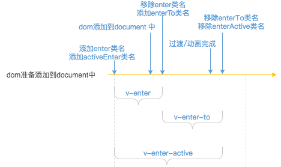
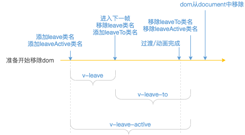

1. 模板中transition标签会根据内建的transition组件选项创建组件实例。组件渲染成页面时调用render函数，获取transition组件标签内的标签对应的节点（默认插槽），并将transition组件标签上的数据合并到该节点VNode上。

```javascript
// 内建的transition组件选项
var transitionProps = {
  name: String,
  appear: Boolean,
  css: Boolean,
  mode: String,
  type: String,
  enterClass: String,
  leaveClass: String,
  enterToClass: String,
  leaveToClass: String,
  enterActiveClass: String,
  leaveActiveClass: String,
  appearClass: String,
  appearActiveClass: String,
  appearToClass: String,
  duration: [Number, String, Object]
};
/* transition组件选项 */
var Transition = {
  name: 'transition',
  props: transitionProps,
  abstract: true,

  render: function render (h) {// 获取Vnode节点，h：createElement
    var this$1 = this;

    var children = this.$slots.default;
    if (!children) {
      return
    }

    // filter out text nodes (possible whitespaces)
    children = children.filter(isNotTextNode);// 过滤文本节点
    /* istanbul ignore if */
    if (!children.length) {
      return
    }

    // warn multiple elements
    if (process.env.NODE_ENV !== 'production' && children.length > 1) {
      warn(
        '<transition> can only be used on a single element. Use ' +
        '<transition-group> for lists.',
        this.$parent
      );
    }

    var mode = this.mode;

    // warn invalid mode
    if (process.env.NODE_ENV !== 'production' &&
      mode && mode !== 'in-out' && mode !== 'out-in'
    ) {
      warn(
        'invalid <transition> mode: ' + mode,
        this.$parent
      );
    }

    var rawChild = children[0];

    // if this is a component root node and the component's
    // parent container node also has transition, skip.
    if (hasParentTransition(this.$vnode)) {// 父级是否存在transition这样的组件根标签
      return rawChild
    }

    // apply transition data to child
    // use getRealChild() to ignore abstract components e.g. keep-alive
    var child = getRealChild(rawChild);// 获取非抽象子节点
    /* istanbul ignore if */
    if (!child) {// 都是抽象节点
      return rawChild
    }

    if (this._leaving) {
      return placeholder(h, rawChild)
    }

    // ensure a key that is unique to the vnode type and to this transition
    // component instance. This key will be used to remove pending leaving nodes
    // during entering.
    var id = "__transition-" + (this._uid) + "-";
    child.key = child.key == null
      ? child.isComment
        ? id + 'comment'
        : id + child.tag
      : isPrimitive(child.key)
        ? (String(child.key).indexOf(id) === 0 ? child.key : id + child.key)
        : child.key;

    var data = (child.data || (child.data = {})).transition = extractTransitionData(this);// 将transition标签上的数据添加到子标签节点data.transition上
    var oldRawChild = this._vnode;
    var oldChild = getRealChild(oldRawChild);

    // mark v-show
    // so that the transition module can hand over the control to the directive
    if (child.data.directives && child.data.directives.some(isVShowDirective)) {
      child.data.show = true;
    }

    if (
      oldChild &&
      oldChild.data &&
      !isSameChild(child, oldChild) &&
      !isAsyncPlaceholder(oldChild) &&
      // #6687 component root is a comment node
      !(oldChild.componentInstance && oldChild.componentInstance._vnode.isComment)// 组件根标签不是注释节点
    ) {
      // replace old child transition data with fresh one
      // important for dynamic transitions!
      var oldData = oldChild.data.transition = extend({}, data);
      // handle transition mode
      if (mode === 'out-in') {// 当前元素先进行过渡，完成之后新元素过渡进入
        // return placeholder node and queue update when leave finishes
        this._leaving = true;
        mergeVNodeHook(oldData, 'afterLeave', function () {// 添加afterLeave回调函数
          this$1._leaving = false;
          this$1.$forceUpdate();
        });
        return placeholder(h, rawChild)
      } else if (mode === 'in-out') {// 新元素先进行过渡，完成之后当前元素过渡离开
        if (isAsyncPlaceholder(child)) {
          return oldRawChild
        }
        var delayedLeave;
        var performLeave = function () { delayedLeave(); };
        mergeVNodeHook(data, 'afterEnter', performLeave);
        mergeVNodeHook(data, 'enterCancelled', performLeave);
        mergeVNodeHook(oldData, 'delayLeave', function (leave) { delayedLeave = leave; });
      }
    }

    return rawChild
  }
};
```

2. transition的create、activete、reomve方法将会添加到节点钩子函数集合中，将在节点patch过程中的不同周期调用，在创建dom后、插入到document之前调用_enter方法，在dom从document移除之前调用leave方法。

```js
var transition = inBrowser ? {
  create: _enter,// 创建dom后调用
  activate: _enter,// 创建组件后，且是transition组件根标签节点时
  remove: function remove$$1 (vnode, rm) {// 从文档中移除前调用
    /* istanbul ignore else */
    if (vnode.data.show !== true) {
      leave(vnode, rm);
    } else {
      rm();// 从文档中移除
    }
  }
} : {};
```

3. 在enter方法中，创建dom、插入到document之前，添加enter和enterActive类名、调用对应的钩子。插入到文档后移除enter类名，添加enterTo类名。动画完成后，移除enterTo和enterActive类名。



```javascript

function enter (vnode, toggleDisplay) {
  var el = vnode.elm;
  ...
  var css = data.css;// 是否通过css实现过渡
  var type = data.type;// 判断是transition还是animation
  var enterClass = data.enterClass;
  var enterToClass = data.enterToClass;
  var enterActiveClass = data.enterActiveClass;
  var appearClass = data.appearClass;
  var appearToClass = data.appearToClass;
  var appearActiveClass = data.appearActiveClass;
  var beforeEnter = data.beforeEnter;// 钩子函数
  var enter = data.enter;// 钩子函数
  var afterEnter = data.afterEnter;// 钩子函数
  var enterCancelled = data.enterCancelled;// 钩子函数
  var beforeAppear = data.beforeAppear;// 钩子函数
  var appear = data.appear;// 钩子函数(节点在初始渲染的过渡)
  var afterAppear = data.afterAppear;// 钩子函数
  var appearCancelled = data.appearCancelled;// 钩子函数
  var duration = data.duration;// 进入的持续时间

  // activeInstance will always be the <transition> component managing this
  // transition. One edge case to check is when the <transition> is placed
  // as the root node of a child component. In that case we need to check
  // <transition>'s parent for appear check.
  var context = activeInstance;
  var transitionNode = activeInstance.$vnode;
  while (transitionNode && transitionNode.parent) {// 向上查找不是组件根标签的祖先节点
    context = transitionNode.context;
    transitionNode = transitionNode.parent;
  }

  var isAppear = !context._isMounted || !vnode.isRootInsert;

  if (isAppear && !appear && appear !== '') {
    return
  }
// 类名
  var startClass = isAppear && appearClass
    ? appearClass
    : enterClass;
  var activeClass = isAppear && appearActiveClass
    ? appearActiveClass
    : enterActiveClass;
  var toClass = isAppear && appearToClass
    ? appearToClass
    : enterToClass;
// 钩子函数
  var beforeEnterHook = isAppear
    ? (beforeAppear || beforeEnter)
    : beforeEnter;
  var enterHook = isAppear
    ? (typeof appear === 'function' ? appear : enter)
    : enter;
  var afterEnterHook = isAppear
    ? (afterAppear || afterEnter)
    : afterEnter;
  var enterCancelledHook = isAppear
    ? (appearCancelled || enterCancelled)
    : enterCancelled;

  var explicitEnterDuration = toNumber(
    isObject(duration)
      ? duration.enter
      : duration
  );

  if (process.env.NODE_ENV !== 'production' && explicitEnterDuration != null) {
    checkDuration(explicitEnterDuration, 'enter', vnode);
  }

  var expectsCSS = css !== false && !isIE9;
  var userWantsControl = getHookArgumentsLength(enterHook);

  var cb = el._enterCb = once(function () {// 动画结束后的回调，第一次调用后失效
    if (expectsCSS) {
      removeTransitionClass(el, toClass);// 移除toClass类名
      removeTransitionClass(el, activeClass);// 移除active类名
    }
    if (cb.cancelled) {
      if (expectsCSS) {
        removeTransitionClass(el, startClass);
      }
      enterCancelledHook && enterCancelledHook(el);// 调用enter过程取消的钩子
    } else {
      afterEnterHook && afterEnterHook(el);// 调用afterEnter钩子
    }
    el._enterCb = null;
  });

  if (!vnode.data.show) {
    // remove pending leave element on enter by injecting an insert hook
    mergeVNodeHook(vnode, 'insert', function () {
      var parent = el.parentNode;
      var pendingNode = parent && parent._pending && parent._pending[vnode.key];
      if (pendingNode &&
        pendingNode.tag === vnode.tag &&
        pendingNode.elm._leaveCb
      ) {
        pendingNode.elm._leaveCb();
      }
      enterHook && enterHook(el, cb);
    });
  }

  // start enter transition
  beforeEnterHook && beforeEnterHook(el);// 在插入文档之前调用beforeEnter钩子
  if (expectsCSS) {
    addTransitionClass(el, startClass);// 添加enter类名，在插入到文档后移除
    addTransitionClass(el, activeClass);// 添加active类名在
    nextFrame(function () {// 下一帧
      removeTransitionClass(el, startClass);// 移除enter类名
      if (!cb.cancelled) {// 当进入leave状态，cb将会被取消
        addTransitionClass(el, toClass);// 插入到文档后添加enterTo类名
        if (!userWantsControl) {
          if (isValidDuration(explicitEnterDuration)) {
            setTimeout(cb, explicitEnterDuration);
          } else {
            whenTransitionEnds(el, type, cb);// 动画结束后调用cb
          }
        }
      }
    });
  }
  ...
}
```

4. leave方法中，dom从document移除之前，添加leave和leaveActive类名，以及对应的钩子。在下一帧移除leave类名，添加leaveTo类名。动画完成后移除leaveTo和leaveActive类名，然后dom从document中移除。



```javascript
function leave (vnode, rm) {
  var el = vnode.elm;

  // call enter callback now
  if (isDef(el._enterCb)) {// 终止enter状态，针对afterEnterHook钩子还没调用的情况，将会触发enterCancelledHook钩子函数
    el._enterCb.cancelled = true;
    el._enterCb();
  }

  var data = resolveTransition(vnode.data.transition);
  if (isUndef(data) || el.nodeType !== 1) {
    return rm()
  }

  /* istanbul ignore if */
  if (isDef(el._leaveCb)) {
    return
  }

  var css = data.css;
  var type = data.type;
  var leaveClass = data.leaveClass;
  var leaveToClass = data.leaveToClass;
  var leaveActiveClass = data.leaveActiveClass;
  var beforeLeave = data.beforeLeave;
  var leave = data.leave;
  var afterLeave = data.afterLeave;
  var leaveCancelled = data.leaveCancelled;
  var delayLeave = data.delayLeave;
  var duration = data.duration;

  var expectsCSS = css !== false && !isIE9;
  var userWantsControl = getHookArgumentsLength(leave);

  var explicitLeaveDuration = toNumber(
    isObject(duration)
      ? duration.leave
      : duration
  );

  if (process.env.NODE_ENV !== 'production' && isDef(explicitLeaveDuration)) {
    checkDuration(explicitLeaveDuration, 'leave', vnode);
  }

  var cb = el._leaveCb = once(function () {
    if (el.parentNode && el.parentNode._pending) {
      el.parentNode._pending[vnode.key] = null;
    }
    if (expectsCSS) {
      removeTransitionClass(el, leaveToClass);
      removeTransitionClass(el, leaveActiveClass);
    }
    if (cb.cancelled) {
      if (expectsCSS) {
        removeTransitionClass(el, leaveClass);
      }
      leaveCancelled && leaveCancelled(el);
    } else {
      rm();// 移除DOM元素，会在本次宏任务执行完开始重新渲染
      afterLeave && afterLeave(el);
    }
    el._leaveCb = null;
    
  });

  if (delayLeave) {
    delayLeave(performLeave);
  } else {
    performLeave();
  }

  function performLeave () {
    // the delayed leave may have already been cancelled
    if (cb.cancelled) {// 被取消了
      return
    }
    // record leaving element
    if (!vnode.data.show && el.parentNode) {
      (el.parentNode._pending || (el.parentNode._pending = {}))[(vnode.key)] = vnode;
    }
    beforeLeave && beforeLeave(el);// 调用beforeLeave钩子函数
    if (expectsCSS) {
      addTransitionClass(el, leaveClass);// 添加leave类名
      addTransitionClass(el, leaveActiveClass)// 添加leaveActive类名
      nextFrame(function () {//
        removeTransitionClass(el, leaveClass);// 在下一帧移除leave类名
        if (!cb.cancelled) {
          addTransitionClass(el, leaveToClass);// 在下一帧添加leaveToClass类名
          if (!userWantsControl) {
            if (isValidDuration(explicitLeaveDuration)) {// 动画完成后或者设定的持续时间完成后移除leaveTo和leaveActive类名，最后dom从document移除
              setTimeout(cb, explicitLeaveDuration);// 在用户设定的持续时间后调用回调函数
            } else {
              whenTransitionEnds(el, type, cb);// 动画结束调用回调函数
            }
          }
        }
      });
    }
    leave && leave(el, cb);
    if (!expectsCSS && !userWantsControl) {
      cb();
    }
  }
}
```
5. vue通过`window.getComputedStyle`获取css设置的动画时间，element.style 读取的只是元素的内联样式，即写在元素的 style 属性上的样式；而 getComputedStyle 读取的样式是最终样式，包括了内联样式、嵌入样式和外部样式。