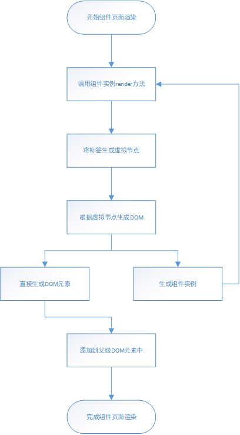

html：

```html
<!DOCTYPE html>
<html lang="zh">
<head>
    <meta charset="UTF-8"/>
    <title>组件渲染的基本过程</title>
</head>
<body>
    <div id="app"></div>
</body>
</html>
```
> main.js：

```javascript
import Vue from "vue";
import Home from "./home.vue";

new Vue({
    el: "#app",
    template: "<Home/>",
    components: { Home }
});
```

home.vue

```html
<template>
    <div class="home">
        <a>{{text}}</a>
    </div>
</template>
<script>
    export default {
        name: "home",
        data() {
            return {
                text: '测试'
            };
        },
        mounted() {
            
        },
        methods: {
        }
    };
</script>
```
1.项目运行编译时，home.vue中的template会被vue-loader编译成render函数，并添加到组件选项对象里。组件通过components引用该组件选项，创建组件（Vue实例），渲染页面(组件被多次引用时，引用的是相同的组件选项，解释data为什么要是函数)。main.js根组件template转化成render函数是由vue插件中的编译器实现的。

```javascript
// 编译器生成的render函数：
var render = function() {
    var _vm = this
    var _h = _vm.$createElement
    var _c = _vm._self._c || _h
    return _c(
        "div",
        { staticClass: "home" },
        [
            _c("a",
                [_vm._v(_vm._s(_vm.text))]
            )
        ]
    )
}
```

```javascript
// 编译后的组件选项对象:
{
    beforeCreate: []
    beforeDestroy: []
    data: function() {}
    methods: {}
    mounted: function() {}
    name: "home"
    render: function() {}
    staticRenderFns: []
    __file: "src/page/home/index.vue"
    _compiled: true
}
```

2.组件渲染页面时会先调用render函数，render函数返回组件内标签节点（VNode实例）。每个标签(包括文本和组件标签等)会创建一个节点，先创建子标签的节点，再父节点创建时将它添加父节点的children数组中，形成与标签结构相同的树形结构。


```javascript
// 虚拟节点构造函数
var VNode = function VNode (
  tag,
  data,
  children,
  text,
  elm,
  context,
  componentOptions,
  asyncFactory
) {
  this.tag = tag;// 标签名
  this.data = data;// 节点数据（原生事件信息），包括节点的钩子函数（包含标签上数据的钩子函数，例如：指令）
  this.children = children;// 当节点是原生标签节点，保存它的子节点
  this.text = text;// 为文本节点或者注释节点时的文本内容
  this.elm = elm;// 节点对应的DOM，组件节点则对应的是该组件内原生根标签DOM
  this.ns = undefined;
  this.context = context;// 节点对应标签所在的组件（组件内包含该标签）
  this.fnContext = undefined;
  this.fnOptions = undefined;
  this.fnScopeId = undefined;
  this.key = data && data.key;// key值
  this.componentOptions = componentOptions;// 缓存组件标签信息：包括组件名称，组件选项、标签上的props、标签上的事件、以及组件标签内的子节点。
  this.componentInstance = undefined;// 组件标签节点对应的组件（Vue实例）
  this.parent = undefined;// 当节点是组件内根标签节点，保存它的组件标签节点
  this.raw = false;
  this.isStatic = false;
  this.isRootInsert = true;
  this.isComment = false;
  this.isCloned = false;
  this.isOnce = false;
  this.asyncFactory = asyncFactory;
  this.asyncMeta = undefined;
  this.isAsyncPlaceholder = false;
};
```

```javascript
// 调用render函数，生成组件模板对应的节点
Vue.prototype._render = function () {
    var vm = this;
    var ref = vm.$options;
    var render = ref.render;
    var _parentVnode = ref._parentVnode;
    ...
    vm.$vnode = _parentVnode;
    // render self
    var vnode;
    ...
    currentRenderingInstance = vm;
    vnode = render.call(vm._renderProxy, vm.$createElement);//返回组件模板形成节点（组件内根标签节点）
    ...
    currentRenderingInstance = null;
    ...
    vnode.parent = _parentVnode;// 设置组件根标签节点的parent为当前组件节点。
    return vnode
};
```
```javascript
// 根据标签创建节点
function _createElement (
  context,
  tag,
  data,
  children,
  normalizationType
) {
    if (isDef(data) && isDef((data).__ob__)) {
        ...
        return createEmptyVNode()
    }
    ...
    if (!tag) {
        return createEmptyVNode()
    }
    ...
    if (typeof tag === 'string') {
        vnode = new VNode(
            config.parsePlatformTagName(tag), data, children,
            undefined, undefined, context
        );
        } else if ((!data || !data.pre) && isDef(Ctor = resolveAsset(context.$options, 'components', tag))) {/* 从组件实例option的components中寻找该标签对应的组件选项 */
        vnode = createComponent(Ctor, data, context, children, tag);// 组件标签节点
        } else {
        vnode = new VNode(
            tag, data, children,
            undefined, undefined, context
        );
        }
    } else {
        vnode = createComponent(tag, data, context, children);// 标签节点
    }
    if (Array.isArray(vnode)) {
        return vnode
    } else if (isDef(vnode)) {
        if (isDef(ns)) { applyNS(vnode, ns); }
        if (isDef(data)) { registerDeepBindings(data); }
        return vnode
    } else {
        return createEmptyVNode()
    }
}
```
3.如果标签是组件标签，通过components获取的组件选项，并使用extend方法生成组件的构造函数，将构造函数和组件选项保存在组件标签节点上。

4.render函数生成组件内标签节点，并设置根节点的parent指向组件节点。将节点作为新节点，传入到patch方法中，组件页面初始更新时，不存在旧节点，直接根据新节点创建DOM。

```javascript
// 组件页面更新
Vue.prototype._update = function (vnode, hydrating) {
    var vm = this;
    var prevEl = vm.$el;
    var prevVnode = vm._vnode;
    var restoreActiveInstance = setActiveInstance(vm);
    vm._vnode = vnode;
    ...
    if (!prevVnode) {// 组件初次渲染
    // initial render
        vm.$el = vm.__patch__(vm.$el, vnode, hydrating, false /* removeOnly */);// 将组件内根标签DOM赋值给实例的$el属性
    } else {
    // updates
        vm.$el = vm.__patch__(prevVnode, vnode);// 将组件内根标签DOM赋值给实例的$el属性
    }
    restoreActiveInstance();
    ...
  };
```

5.在patch方法中，根据节点创建DOM，并在节点上保存它的DOM引用，再根据节点的children值，创建子节点的DOM，再添加到父节点的DOM中，完成组件的渲染。

```javascript
// 根据节点类型（原生标签或者组件标签），创建组件或者DOM
function createElm (
    vnode,
    insertedVnodeQueue,
    parentElm,
    refElm,
    nested,
    ownerArray,
    index
  ) {
   ...
    vnode.isRootInsert = !nested; // for transition enter check
    if (createComponent(vnode, insertedVnodeQueue, parentElm, refElm)) {// 如果vnode是组件节点，创建组件
      return
    }

    var data = vnode.data;
    var children = vnode.children;
    var tag = vnode.tag;
    if (isDef(tag)) {
      ...
      vnode.elm = vnode.ns // 创建DOM
        ? nodeOps.createElementNS(vnode.ns, tag)
        : nodeOps.createElement(tag, vnode);
      setScope(vnode);// 添加DOM属性，构造css作用域
      {
        createChildren(vnode, children, insertedVnodeQueue);// 创建子节点的DOM
        if (isDef(data)) {
          invokeCreateHooks(vnode, insertedVnodeQueue);
        }
        insert(parentElm, vnode.elm, refElm);// 添加父节点的DOM中
      }
        ...
    } else if (isTrue(vnode.isComment)) {// 注释节点
      vnode.elm = nodeOps.createComment(vnode.text);
      insert(parentElm, vnode.elm, refElm);// 添加DOM
    } else {// 文本节点
      vnode.elm = nodeOps.createTextNode(vnode.text);
      insert(parentElm, vnode.elm, refElm);// 添加DOM
    }
  }
```

6.在根据节点创建DOM的过程中，如果节点包含组件构造器信息（即是组件节点），会先使用构造器创建组件，调用组件render方法，执行以上操作，生成组件内标签对应的节点，再根据节点生成DOM，并将根标签节点的DOM保存在组件上，然后添加到父节点的DOM上，完成组件的渲染。DOM添加到页面的过程是从下往上依次添加，DOM添加到父级DOM中，父级DOM添加到它的父级DOM中，迭代添加，最后将最上级的DOM添加到页面。

```javascript
// 生成组件，并将组件内根标签DOM添加到父级DOM中：
function createComponent (vnode, insertedVnodeQueue, parentElm, refElm) {
    var i = vnode.data;
    if (isDef(i)) {
        var isReactivated = isDef(vnode.componentInstance) && i.keepAlive;
        if (isDef(i = i.hook) && isDef(i = i.init)) {
            i(vnode, false /* hydrating */);// 调用节点钩子函数init，生成组件
        }
        if (isDef(vnode.componentInstance)) {
            initComponent(vnode, insertedVnodeQueue);
            insert(parentElm, vnode.elm, refElm);// 组件内根标签DOM添加到父级DOM中
            if (isTrue(isReactivated)) {
            reactivateComponent(vnode, insertedVnodeQueue, parentElm, refElm);
            }
            return true
        }
    }
}
```

```javascript
// 在节点钩子函数init创建组件
function init (vnode, hydrating) {
    ...
    var child = vnode.componentInstance = createComponentInstanceForVnode(// 创建组件
    vnode,
    activeInstance// 父组件
    );
    child.$mount(hydrating ? vnode.elm : undefined, hydrating);//渲染页面
}  
```

