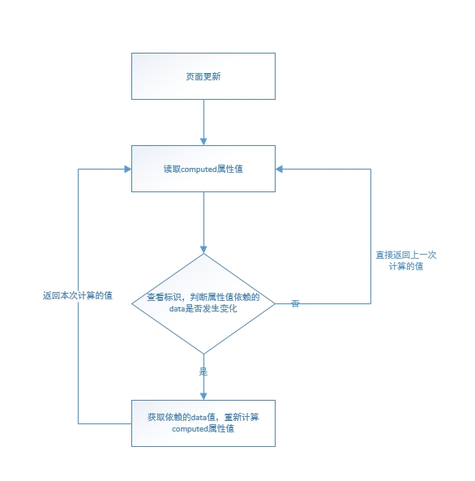
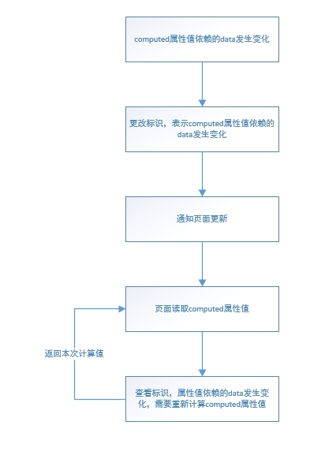

1.每个 computed 属性都会生成对应的观察者（Watcher 实例），观察者存在 values 属性和 get 方法。computed 属性的 getter 函数会在 get 方法中调用，并将返回值赋值给 value。初始设置 dirty 和 lazy 的值为 true，lazy 为 true 不会立即 get 方法（懒执行），而是会在读取 computed 值时执行。

```javascript
function initComputed (vm, computed) {
  var watchers = vm._computedWatchers = Object.create(null);// 存放computed的观察者
  var isSSR = isServerRendering();
  for (var key in computed) {
    var userDef = computed[key];
    var getter = typeof userDef === 'function' ? userDef : userDef.get;
    ...
    watchers[key] = new Watcher(// 生成观察者（Watcher实例）
      vm,
      getter || noop,// getter将在观察者get方法中执行
      noop,
      computedWatcherOptions // { lazy: true }懒执行，暂不执行get方法，当读取computed属性值执行
    );
    ...
    defineComputed(vm, key, userDef);
    ...
  }
}
```

2.将 computed 属性添加到组件实例上，并通过 get、set 获取或者设置属性值，并且重定义 getter 函数，

```javascript
function defineComputed(target, key, userDef) {
    var shouldCache = !isServerRendering();
    ...
    sharedPropertyDefinition.get = shouldCache // 重定义getter函数
        ? createComputedGetter(key)
        : createGetterInvoker(userDef);
   ...
    Object.defineProperty(target, key, sharedPropertyDefinition); // 将computed属性添加到组件实例上
}
```

```javascript
// 重定义的getter函数
function createComputedGetter(key) {
    return function computedGetter() {
        var watcher = this._computedWatchers && this._computedWatchers[key];
        if (watcher) {
            if (watcher.dirty) {
                // true，懒执行
                watcher.evaluate(); // 执行watcher方法后设置dirty为false
            }
            if (Dep.target) {
                watcher.depend();
            }
            return watcher.value; //返回观察者的value值
        }
    };
}
```

3.页面初始渲染时，读取 computed 属性值，触发重定义后的 getter 函数。由于观察者的 dirty 值为 true，将会调用 get 方法，执行原始 getter 函数。getter 函数中会读取 data（响应式）数据，读取数据时会触发 data 的 getter 方法，会将 computed 属性对应的观察者添加到 data 的依赖收集器中（用于 data 变更时通知更新）。观察者的 get 方法执行完成后，更新观察者的 value 值，并将 dirty 设置为 false，表示 value 值已更新，之后在执行观察者的 depend 方法，将上层观察者（该观察者包含页面更新的方法，方法中读取了 computed 属性值）也添加到 getter 函数中 data 的依赖收集器中（getter 中的 data 的依赖器收集器包含 computed 对应的观察者，以及包含页面更新方法（调用了 computed 属性）的观察者），最后返回 computed 观察者的 value 值。



4.当更改了 computed 属性 getter 函数依赖的 data 值时，将会根据之前依赖收集的观察者，依次调用观察者的 update 方法，先调用 computed 观察者的 update 方法，由于 lazy 为 true，将会设置观察者的 dirty 为 true，表示 computed 属性 getter 函数依赖的 data 值发生变化，但不调用观察者的 get 方法更新 value 值。再调用包含页面更新方法的观察者的 update 方法，在更新页面时会读取 computed 属性值，触发重定义的 getter 函数，此时由于 computed 属性的观察者 dirty 为 true，调用该观察者的 get 方法，更新 value 值，并返回，完成页面的渲染。



5.dirty 值初始为 true，即首次读取 computed 属性值时，根据 setter 计算属性值，并保存在观察者 value 上，然后设置 dirty 值为 false。之后读取 computed 属性值时，dirty 值为 false，不调用 setter 重新计算值，而是直接返回观察者的 value，也就是上一次计算值。只有当 computed 属性 setter 函数依赖的 data 发生变化时，才设置 dirty 为 true，即下一次读取 computed 属性值时调用 setter 重新计算。也就是说，computed 属性依赖的 data 不发生变化时，不会调用 setter 函数重新计算值，而是读取上一次计算值。
