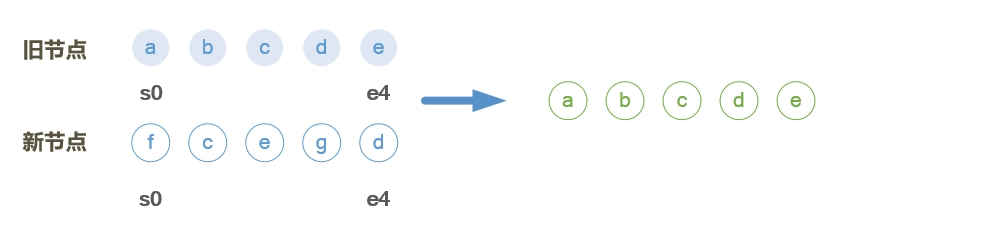
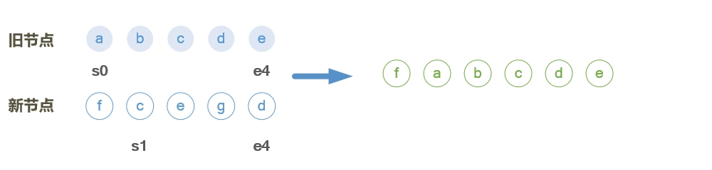
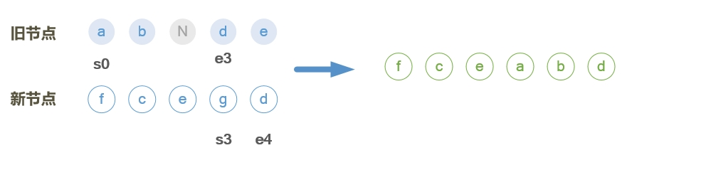
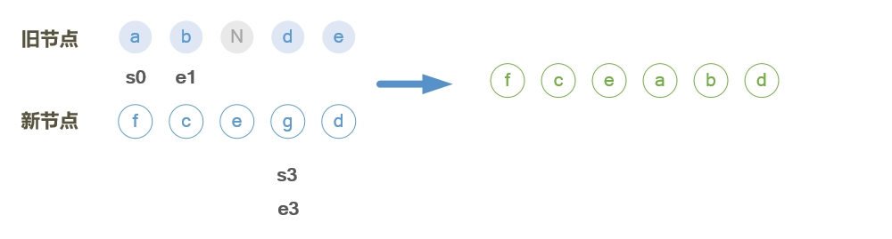
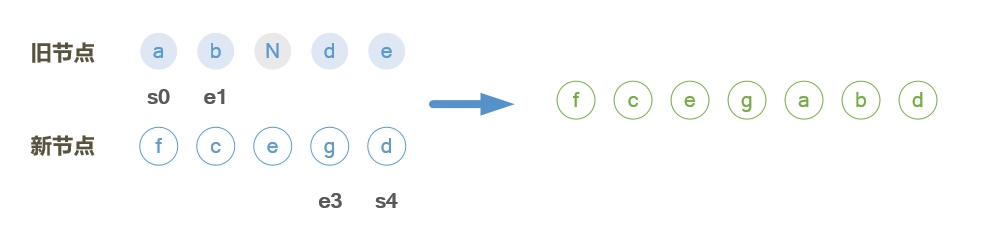
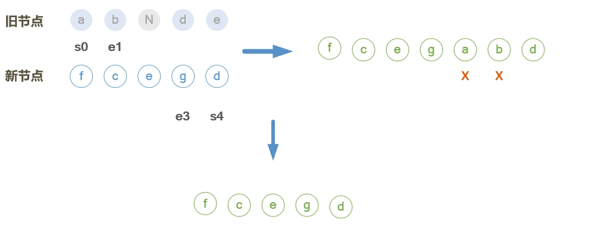

# patch的流程

>组件页面渲染时，将render返回的新vnode（新节点）和组件实例保存的vnode（旧节点）作为参数，调用patch方法，更新DOM。

## 判断两个节点是否相同

>处理过程中，需要判断节点是否相同。相同节点需要满足以下条件：
- key相同
- 标签类型相同
- 注释节点标识相同，都是注释节点，或者都不是注释节点
- data的值状态相同，或者都有值，或者都没值
```javascript
function sameVnode (a, b) {// 判断两个VNode节点是否是同一个节点
    return (
        a.key === b.key && // key相同
        (
            a.tag === b.tag && // tag相同
            a.isComment === b.isComment && // 注释节点标识相同
            isDef(a.data) === isDef(b.data) && // data值状态相同
            sameInputType(a, b) // input的type相同
        )
    )
}
```

## patch方法

>patch判断流程如下：

- a) 如果新节点为空，此时旧节点存在（组件销毁时），调用旧节点destroy生命周期函数

- b) 如果旧节点为空，根据新节点创建DOM

- c) 其他（如果新旧节点都存在）

    - a) 旧节点不是DOM(组件节点)，且新旧节点相同
        - 执行patchVnode
    - b) 旧节点是DOM元素或者两个节点不相同
        - 创建新节点DOM，销毁旧节点以及DOM。

```javascript
return function patch (oldVnode, vnode, hydrating, removeOnly) {
    if (isUndef(vnode)) {
      if (isDef(oldVnode)) { invokeDestroyHook(oldVnode); }
      return
    }
    ...
    if (isUndef(oldVnode)) {
      isInitialPatch = true;// 组件初始加载
      createElm(vnode, insertedVnodeQueue);
    } else {
      var isRealElement = isDef(oldVnode.nodeType);
      if (!isRealElement && sameVnode(oldVnode, vnode)) {
        patchVnode(oldVnode, vnode, insertedVnodeQueue, null, null, removeOnly);
      } else {
        ...
        var oldElm = oldVnode.elm;
        var parentElm = nodeOps.parentNode(oldElm);// 获取父元素
        // create new node
        createElm(
          vnode,
          insertedVnodeQueue,
          oldElm._leaveCb ? null : parentElm,
          nodeOps.nextSibling(oldElm)// 获取紧跟的弟弟元素
        );
        if (isDef(parentElm)) {
          removeVnodes(parentElm, [oldVnode], 0, 0);// 销毁旧节点以及DOM元素
        } else if (isDef(oldVnode.tag)) {
          invokeDestroyHook(oldVnode);
        }
      }
    }
    invokeInsertHook(vnode, insertedVnodeQueue, isInitialPatch);
    return vnode.elm
  }
}
```

## patchVnode方法

>当两个节点相同时，执行patchVnode方法。在处理各种情况之前，会将旧节点elm属性值赋值给新节点的elm属性，保持elm保持一致。

>具体流程如下：

- a）如果新旧节点完全相同（引用相同 oldVnode === vnode）
    - 直接返回不处理
- b) 如果新节点不是文本节点
    - a)都存在子节点，新旧节点的子节点数组引用不同（oldCh !== ch）
        - updateChildren
    - b)新节点有子节点，旧节点没有
        - 1）查重子节点（key）
        - 2）如果旧节点是文本节点，先清空文本
        - 3）创建子节点DOM元素
    - c)旧节点有子节点，新节点没有
        - 移除子节点以及DOM
    - d)旧节点是文本节点
        - 清除文本
- c)如果新节点是文本节点，并且和旧节点文本不相同
    - 则直接替换文本内容。
- d)其他（新节点是文本节点，并且和旧节点相同）
    - 不处理

```javascript
 function patchVnode (
    oldVnode,
    vnode,
    insertedVnodeQueue,
    ownerArray,
    index,
    removeOnly
  ) {
    if (oldVnode === vnode) {
      return
    }
   ...
    if (isUndef(vnode.text)) {
      if (isDef(oldCh) && isDef(ch)) {
        if (oldCh !== ch) { updateChildren(elm, oldCh, ch, insertedVnodeQueue, removeOnly); }
      } else if (isDef(ch)) {
        if (process.env.NODE_ENV !== 'production') {
          checkDuplicateKeys(ch);
        }
        if (isDef(oldVnode.text)) { nodeOps.setTextContent(elm, ''); }
        addVnodes(elm, null, ch, 0, ch.length - 1, insertedVnodeQueue);
      } else if (isDef(oldCh)) {
        removeVnodes(elm, oldCh, 0, oldCh.length - 1);
      } else if (isDef(oldVnode.text)) {
        nodeOps.setTextContent(elm, '');
      }
    } else if (oldVnode.text !== vnode.text) {
      nodeOps.setTextContent(elm, vnode.text);
    }
   ...
  }

```
## updateChildren方法

>updateChildren方法处理相同新旧节点的子节点。方法定义了以下变量（updateChildren的节点都表示的是子节点）：

```javascript
    var oldStartIdx = 0;// 表示当前正在处理的旧起始节点序号
    var newStartIdx = 0;// 表示当前正在处理的新起始节点序号
    var oldEndIdx = oldCh.length - 1;// 表示当前正在处理的旧结尾节点序号
    var oldStartVnode = oldCh[0];// 表示当前正在处理的旧起始节点
    var oldEndVnode = oldCh[oldEndIdx];// 表示当前正在处理的旧结尾节点
    var newEndIdx = newCh.length - 1;// 表示当前正在处理的新结尾节点序号
    var newStartVnode = newCh[0];// 表示当前正在处理的新起始节点
    var newEndVnode = newCh[newEndIdx];// 表示当前正在处理的新结尾节点
    var oldKeyToIdx, // 尚未处理的旧节点key值映射
        idxInOld, // 与新节点key值相同的旧节点序号
        vnodeToMove, // 与新节点key值相同的旧节点
        refElm;// 指向当前正在处理的新结尾节点的后一个节点（已处理）的DOM元素
```
>根据新旧节点的对比结果，更新DOM元素，此过程并不改变新旧节点的排序。序号指向正在处理的节点，分别是新旧节点的起始和结尾节点。对比过程以新起始节点为主导，对比方向是由两侧向中间。优先比对新旧节点的起始节点和结尾节点，再查找与新起始节点相同的且未处理的旧节点。当旧节点全部处理完（旧起始和结尾序号重叠），此时新节点可能未处理完，就添加新节点DOM元素。当新节点全部处理完（新起始和结尾序号重叠），可能存在旧节点，就删除旧节点DOM元素。

>具体流程如下：

1. 新旧子节点的起始序号不大于结尾序号时，执行以下流程：
    - a)如果旧子节点两侧存在`undefined`节点
        - 旧起始节点`undefined`,`oldStartVnode = oldCh[++oldStartIdx]`
        - 旧结尾节点`undefined`,`oldEndVnode = oldCh[--oldEndIdx]`
    - b)新旧子节点的起始节点相同（前后比较）
        - `patchVNode`更新DOM内容
        - `oldStartVnode = oldCh[++oldStartIdx]`
        - `newStartVnode = newCh[++newStartIdx]`
    - c)新旧子节点的结尾节点相同（前后比较）
        - `patchVNode`更新DOM内容
        - `oldEndVnode = oldCh[--oldEndIdx]`
        - `newEndVnode = newCh[--newEndIdx]`
    - d)旧起始节点和新结尾节点相同（前后比较）
        - `patchVNode`更新DOM内容
        - 将旧起始节点DOM添加到旧结尾节点DOM前面
        - `oldStartVnode = oldCh[++oldStartIdx]`
        - `newEndVnode = newCh[--newEndIdx]`
    - e)旧结尾节点和新起始节点相同（前后比较）
        - `patchVNode`更新DOM内容
        - 将旧结尾节点DOM添加到旧起始节点DOM前面
        - `oldEndVnode = oldCh[--oldEndIdx]`
        - `newStartVnode = newCh[++newStartIdx]`
    - f)其他(缓存尚未处理的旧节点key值，依此判断旧节点中是否存在和新起始节点相同的节点)
        - a)尚未处理的旧节点中不存在与新起始节点相同的节点
            - 创建新节点DOM并添加到旧起始节点DOM的前面
            - `newStartVnode = newCh[++newStartIdx]`
        - b)旧节点中存在与新起始节点key相同的节点
            - a)旧节点中存在与新起始节点相同的节点
                - `patchVode`
                - 将相同的旧节点DOM添加到旧起始节点DOM前面
                - 将相同的旧节点置为undefined`oldCh[idxInOld] = undefined`
                - `newStartVnode = newCh[++newStartIdx]`
            - b)key相同,但标签类型不同的节点
                - 创建新节点DOM并添加到旧起始节点DOM的前面
                - `newStartVnode = newCh[++newStartIdx]`
2. 循环结束
    - a)如果旧节点遍历完（`oldStartIdx > oldEndIdx`）
        - 把剩余未处理新节点DOM添加到上一个新结尾节点DOM前面（从新起始节点到新结尾节点，都未处理过）
    - b)如果新节点遍历完（`newStartIdx > newEndIdx`）
        - 移除旧起始和结尾节点以及他们之间的节点的DOM（从旧起始节点到旧结尾节点，可能存在处理过的节点，但处理过已被置为undefined）

```javascript
function updateChildren (parentElm, oldCh, newCh, insertedVnodeQueue, removeOnly) {
    var oldStartIdx = 0;// 表示当前正在处理的旧起始节点序号
    var newStartIdx = 0;// 表示当前正在处理的新起始节点序号
    var oldEndIdx = oldCh.length - 1;// 表示当前正在处理的旧结尾节点序号
    var oldStartVnode = oldCh[0];// 表示当前正在处理的旧起始节点
    var oldEndVnode = oldCh[oldEndIdx];// 表示当前正在处理的旧结尾节点
    var newEndIdx = newCh.length - 1;// 表示当前正在处理的新结尾节点序号
    var newStartVnode = newCh[0];// 表示当前正在处理的新起始节点
    var newEndVnode = newCh[newEndIdx];// 表示当前正在处理的新结尾节点
    var oldKeyToIdx, idxInOld, vnodeToMove, refElm;
   ...
    while (oldStartIdx <= oldEndIdx && newStartIdx <= newEndIdx) {
      if (isUndef(oldStartVnode)) {
        oldStartVnode = oldCh[++oldStartIdx]; // Vnode has been moved left
      } else if (isUndef(oldEndVnode)) {
        oldEndVnode = oldCh[--oldEndIdx];
      } else if (sameVnode(oldStartVnode, newStartVnode)) {
        patchVnode(oldStartVnode, newStartVnode, insertedVnodeQueue, newCh, newStartIdx);
        oldStartVnode = oldCh[++oldStartIdx];
        newStartVnode = newCh[++newStartIdx];
      } else if (sameVnode(oldEndVnode, newEndVnode)) {
        patchVnode(oldEndVnode, newEndVnode, insertedVnodeQueue, newCh, newEndIdx);
        oldEndVnode = oldCh[--oldEndIdx];
        newEndVnode = newCh[--newEndIdx];
      } else if (sameVnode(oldStartVnode, newEndVnode)) { // Vnode moved right
        patchVnode(oldStartVnode, newEndVnode, insertedVnodeQueue, newCh, newEndIdx);
        canMove && nodeOps.insertBefore(parentElm, oldStartVnode.elm, nodeOps.nextSibling(oldEndVnode.elm));
        oldStartVnode = oldCh[++oldStartIdx];
        newEndVnode = newCh[--newEndIdx];
      } else if (sameVnode(oldEndVnode, newStartVnode)) { // Vnode moved left
        patchVnode(oldEndVnode, newStartVnode, insertedVnodeQueue, newCh, newStartIdx);
        canMove && nodeOps.insertBefore(parentElm, oldEndVnode.elm, oldStartVnode.elm);
        oldEndVnode = oldCh[--oldEndIdx];
        newStartVnode = newCh[++newStartIdx];
      } else {
        if (isUndef(oldKeyToIdx)) { oldKeyToIdx = createKeyToOldIdx(oldCh, oldStartIdx, oldEndIdx); }// 缓存尚未处理的旧节点key值
        idxInOld = isDef(newStartVnode.key)
          ? oldKeyToIdx[newStartVnode.key]
          : findIdxInOld(newStartVnode, oldCh, oldStartIdx, oldEndIdx);
        if (isUndef(idxInOld)) { // New element
          createElm(newStartVnode, insertedVnodeQueue, parentElm, oldStartVnode.elm, false, newCh, newStartIdx);
        } else {
          vnodeToMove = oldCh[idxInOld];
          if (sameVnode(vnodeToMove, newStartVnode)) {
            patchVnode(vnodeToMove, newStartVnode, insertedVnodeQueue, newCh, newStartIdx);
            oldCh[idxInOld] = undefined;
            canMove && nodeOps.insertBefore(parentElm, vnodeToMove.elm, oldStartVnode.elm);
          } else {
            // same key but different element. treat as new element
            createElm(newStartVnode, insertedVnodeQueue, parentElm, oldStartVnode.elm, false, newCh, newStartIdx);
          }
        }
        newStartVnode = newCh[++newStartIdx];
      }
    }
    if (oldStartIdx > oldEndIdx) {
      refElm = isUndef(newCh[newEndIdx + 1]) ? null : newCh[newEndIdx + 1].elm;
      addVnodes(parentElm, refElm, newCh, newStartIdx, newEndIdx, insertedVnodeQueue);
    } else if (newStartIdx > newEndIdx) {
      removeVnodes(parentElm, oldCh, oldStartIdx, oldEndIdx);
    }
  }
```
## updateChildren方法实例：

1. 左边表示新旧节点，节点下面标识起始和结尾节点（即正在处理的节点）。右边表示当前的DOM。



2. 新节点的起始和结尾节点与旧节点的起始和结尾节点互不相同，并且在旧节点中未找到与新起始节点(新节点**f**)相同的节点。
所以创建节点**f**的DOM并添加到旧起始节点（旧节点**a**）DOM的前面，然后新起始节点序号加1，表示新节点**f**已处理，当前正在处理新起始节点**c**。



3. 新节点的起始和结尾节点与旧节点的起始和结尾节点互不相同，但在旧节点中找到与新起始节点(节点**c**)相同的节点。
所以将旧节点**c**的DOM添加到旧起始节点（旧节点**a**）DOM的前面，旧节点**c**置空，然后新起始节点序号加1，表示新节点**c**已处理，当前正在处理新起始节点**e**。


4. 新起始节点（新节点**e**）和旧结尾节点(旧节点**e**)相同。更新旧节点**e**的DOM内容，并将旧节点**e**的DOM移动到旧起始节点（旧节点**a**）DOM的前面，旧结尾节点序号减1，新起始节点加1，表示新旧节点e已处理，当前正在处理的是新起始节点**g**和旧结尾节点**d**。



5. 新结尾节点（新节点**d**）和旧结尾节点(旧节点**d**)相同。仅更新旧节点**d**的DOM内容。新结尾节点序号减1，旧结尾节点序号减1，表示新旧节点d已处理，当前正在处理的是新结尾节点**g**和旧结尾节点**c**。由于旧节点**c**为空，则旧结尾节点为**b**。



6. 新节点的起始和结尾节点与旧节点的起始和结尾节点互不相同，并且在旧节点中未找到与新起始节点(新节点**g**)相同的节点。
所以创建节点**g**的DOM并添加到旧起始节点（旧节点**a**）DOM的前面，然后新起始节点序号加1，表示新节点**g**已处理，当前正在处理新起始节点**d**。



7. 由于新起始和结尾节点序号重叠，新节点已经处理完毕，存在尚未处理的旧节点，则移除未处理的旧节点DOM。



8.结束，最终的DOM。


