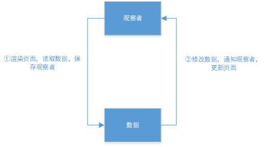

1.获取组件选项的 data，然后调用 data 函数（上下文和参数都是组件实例），返回 data 数据保存到组件`_data`属性上，再由组件代理`_data`属性上的数据。最后调用observe实现data数据的响应式。

> 如果组件选项中的 data 是对象而不是函数，当存在多个该组件时，引用的是相同的组件选项对象，组件操作data会互相影响。data数据之间也不能通过this互相引用，因为先创建data数据对象，然后组件才代理data数据。

```javascript
function initData (vm) {
  var data = vm.$options.data;
  data = vm._data = typeof data === 'function'// 调用data函数获取数据，并赋值到组件实例_data上(data函数的上下文和参数都是组件实例vm)
    ? getData(data, vm)
    : data || {};
    ...
  // proxy data on instance
  var keys = Object.keys(data);
  var props = vm.$options.props;
  var methods = vm.$options.methods;
  var i = keys.length;
  while (i--) {// 判断是否和methods和props重名
    var key = keys[i];
    if (process.env.NODE_ENV !== 'production') {
      if (methods && hasOwn(methods, key)) {
        warn(
          ("Method \"" + key + "\" has already been defined as a data property."),
          vm
        );
      }
    }
    if (props && hasOwn(props, key)) {
      process.env.NODE_ENV !== 'production' && warn(
        "The data property \"" + key + "\" is already declared as a prop. " +
        "Use prop default value instead.",
        vm
      );
    } else if (!isReserved(key)) {
      proxy(vm, "_data", key);// 组件代理_data数据（组件未代理之前）
    }
  }
  // observe data
  observe(data, true /* asRootData */);// 响应式设置
}
```

2.在observe函数中，创建Observer实例，实现data数据的响应式。

```javascript
function observe (value, asRootData) {
  if (!isObject(value) || value instanceof VNode) {
    return
  }
  var ob;
  if (hasOwn(value, '__ob__') && value.__ob__ instanceof Observer) {
    ob = value.__ob__;
  } else if (
    shouldObserve &&
    !isServerRendering() &&
    (Array.isArray(value) || isPlainObject(value)) &&
    Object.isExtensible(value) &&
    !value._isVue
  ) {
    ob = new Observer(value);
  }
  if (asRootData && ob) {
    ob.vmCount++;
  }
  return ob
}
```

3.Observer构造器中，将Obsserver实例保存到数据中。判断数据类型是否为数组，根据判断结果进行不同的操作。

```javascript
var Observer = function Observer (value) {
  this.value = value;
  this.dep = new Dep();
  this.vmCount = 0;
  def(value, '__ob__', this);// 将Obsserver实例保存到数据中
  if (Array.isArray(value)) {
    if (hasProto) {
      protoAugment(value, arrayMethods); // 将数组__proto__指向arrayMethods
    } else {
      copyAugment(value, arrayMethods, arrayKeys);
    }
    this.observeArray(value);// 遍历数组，对数组元素继续调用observe方法
  } else {
    this.walk(value);
  }
};
```
4.如果是数组，更改数组的`__proto__`指向`arrayMethods`，而`arrayMethods`的`__proto__`指向`Array.prototype`（`arrayMethods = Object.create(Array.prototype)`）。通过添加`arrayMethods`中间层，代理数组方法，可以监测到数组的更新触发通知。再调用Observer实例的observeArray方法，遍历数组，对数组元素继续调用observe方法。

```javascript
function protoAugment (target, src) {
  /* eslint-disable no-proto */
  target.__proto__ = src;
  /* eslint-enable no-proto */
}
Observer.prototype.observeArray = function observeArray (items) {
  for (var i = 0, l = items.length; i < l; i++) {
    observe(items[i]);
  }
};
var arrayProto = Array.prototype;
var arrayMethods = Object.create(arrayProto);

var methodsToPatch = [
  'push',
  'pop',
  'shift',
  'unshift',
  'splice',
  'sort',
  'reverse'
];

methodsToPatch.forEach(function (method) {
  var original = arrayProto[method];// 缓存原生数组方法
  def(arrayMethods, method, function mutator () {
    var args = [], len = arguments.length;
    while ( len-- ) args[ len ] = arguments[ len ];
    var result = original.apply(this, args);// 调用原生数组方法
    var ob = this.__ob__;
    var inserted;
    switch (method) {
      case 'push':
      case 'unshift':
        inserted = args;
        break
      case 'splice':
        inserted = args.slice(2);
        break
    }
    if (inserted) { ob.observeArray(inserted); }// ？为什么push时没有遍历设置响应式
    ob.dep.notify();// 通知更新
    return result
  });
});
```
4.如果数据不是数组是对象，则遍历对象，调用`defineReactive$$1`，实现对象属性的响应式。

```javascript
Observer.prototype.walk = function walk (obj) {
  var keys = Object.keys(obj);
  for (var i = 0; i < keys.length; i++) {
    defineReactive$$1(obj, keys[i]);
  }
};
```
5.`defineReactive$$1`函数中，每个对象属性都存在一个`Dep`实例，收集依赖（读取）该属性值的观察者。先对属性值继续调用observe，再定义属性，添加属性的get和set方法。当读取该属性时，触发get方法，将当前观察者保存到Dep实例上。当属性值修改时，触发set方法，对修改后的属性值调用observe方法，并通知之前保存的观察者。

```javascript
function defineReactive$$1 (
  obj,
  key,
  val,
  customSetter,
  shallow // 是否不可以修改值
) {
  var dep = new Dep();

  var property = Object.getOwnPropertyDescriptor(obj, key);
  if (property && property.configurable === false) { // 属性不可配置时则不能设置
    return
  }

  // cater for pre-defined getter/setters 在属性可能在设置可响应之前就存在get和set
  var getter = property && property.get;
  var setter = property && property.set;
  if ((!getter || setter) && arguments.length === 2) { // 当不存在get或者存在get且没有提供value值时
    val = obj[key];
  }

  var childOb = !shallow && observe(val);
  Object.defineProperty(obj, key, {
    enumerable: true,
    configurable: true,
    get: function reactiveGetter () {
      var value = getter ? getter.call(obj) : val;
      if (Dep.target) {// 当前观察者（观察者执行渲染页面操作）
        dep.depend(); // 将当前watcher收集到依赖中
        if (childOb) {
          childOb.dep.depend();
          if (Array.isArray(value)) {
            dependArray(value);
          }
        }
      }
      return value
    },
    set: function reactiveSetter (newVal) {
      var value = getter ? getter.call(obj) : val;
      /* eslint-disable no-self-compare */
      if (newVal === value || (newVal !== newVal && value !== value)) {
        return
      }
      /* eslint-enable no-self-compare */
      if (process.env.NODE_ENV !== 'production' && customSetter) {
        customSetter();
      }
      // #7981: for accessor properties without setter
      if (getter && !setter) { return }
      if (setter) {
        setter.call(obj, newVal);
      } else {
        val = newVal;
      }
      childOb = !shallow && observe(newVal);
      dep.notify();
    }
  });
}
```
6.组件调用`mountComponent`方法，开始渲染组件页面。每个组件渲染都会创建一个观察者(Watcher实例)，页面更新函数保存到观察者的getter属性上。

```javascript
// 开始渲染dom
function mountComponent (
  vm,
  el,
  hydrating
) {
  vm.$el = el;
  if (!vm.$options.render) {
    vm.$options.render = createEmptyVNode;
    if (process.env.NODE_ENV !== 'production') {
      /* istanbul ignore if */
      if ((vm.$options.template && vm.$options.template.charAt(0) !== '#') ||
        vm.$options.el || el) {
        warn(
          'You are using the runtime-only build of Vue where the template ' +
          'compiler is not available. Either pre-compile the templates into ' +
          'render functions, or use the compiler-included build.',
          vm
        );
      } else {
        warn(
          'Failed to mount component: template or render function not defined.',
          vm
        );
      }
    }
  }
  callHook(vm, 'beforeMount');

  var updateComponent;
  /* istanbul ignore if */
  if (process.env.NODE_ENV !== 'production' && config.performance && mark) {
    updateComponent = function () {
      var name = vm._name;
      var id = vm._uid;
      var startTag = "vue-perf-start:" + id;
      var endTag = "vue-perf-end:" + id;

      mark(startTag);
      var vnode = vm._render();
      mark(endTag);
      measure(("vue " + name + " render"), startTag, endTag);

      mark(startTag);
      vm._update(vnode, hydrating);
      mark(endTag);
      measure(("vue " + name + " patch"), startTag, endTag);
    };
  } else {
    updateComponent = function () {
      vm._update(vm._render(), hydrating);// 更新视图
    };
  }

  // we set this to vm._watcher inside the watcher's constructor
  // since the watcher's initial patch may call $forceUpdate (e.g. inside child
  // component's mounted hook), which relies on vm._watcher being already defined
  new Watcher(vm, updateComponent, noop, {
    before: function before () {
      if (vm._isMounted && !vm._isDestroyed) {
        callHook(vm, 'beforeUpdate');
      }
    }
  }, true /* isRenderWatcher */);
  hydrating = false;

  // manually mounted instance, call mounted on self
  // mounted is called for render-created child components in its inserted hook
  if (vm.$vnode == null) {
    vm._isMounted = true;
    callHook(vm, 'mounted');
  }
  return vm
}
```
7.该观察者在创建过程中，会调用`getter`函数，调用之前保存该观察者在`Dep.target`上。调用页面更新的`getter`函数会读取`data`中的数据，读取对象属性会触发属性的`get`函数，将`Dep.target`添加到对象属性对应的`Dep`实例上。调用完成之后移除保存在`Dep.target`上的观察者。

```javascript
var Watcher = function Watcher (
  vm,
  expOrFn,// 更新时调用的方法
  cb,// 更新完调用，传入更新前后的值
  options,
  isRenderWatcher
) {
  this.vm = vm;
  if (isRenderWatcher) {
    vm._watcher = this;
  }
  vm._watchers.push(this);
  // options
  if (options) {
    this.deep = !!options.deep;
    this.user = !!options.user;
    this.lazy = !!options.lazy;
    this.sync = !!options.sync;
    this.before = options.before;
  } else {
    this.deep = this.user = this.lazy = this.sync = false;
  }
  this.cb = cb;
  this.id = ++uid$2; // uid for batching
  this.active = true;
  this.dirty = this.lazy; // for lazy watchers
  this.deps = [];
  this.newDeps = [];
  this.depIds = new _Set();
  this.newDepIds = new _Set();
  this.expression = process.env.NODE_ENV !== 'production'
    ? expOrFn.toString()
    : '';
  // parse expression for getter
  if (typeof expOrFn === 'function') {
    this.getter = expOrFn;
  } else {
      ...
  }
  this.value = this.lazy
    ? undefined
    : this.get();
};

/**
 * Evaluate the getter, and re-collect dependencies.
 */
Watcher.prototype.get = function get () {
  pushTarget(this);// 设置当前观察者为全局观察者，并加入堆栈
  var value;
  var vm = this.vm;
  try {
    value = this.getter.call(vm, vm);
  } catch (e) {
    if (this.user) {
      handleError(e, vm, ("getter for watcher \"" + (this.expression) + "\""));
    } else {
      throw e
    }
  } finally {
    // "touch" every property so they are all tracked as
    // dependencies for deep watching
    if (this.deep) {
      traverse(value);
    }
    popTarget();// 从全局观察者上移除，并移除堆栈
    this.cleanupDeps();
  }
  return value
};

```
8.修改data数据时，会通知观察者，触发观察者的update方法。调用queueWatcher将观察者添加到队列中，并在微任务中执行观察者的getter方法更新页面。

```javascript
Watcher.prototype.update = function update () {
  /* istanbul ignore else */
  if (this.lazy) {
    this.dirty = true;
  } else if (this.sync) {
    this.run();
  } else {
    queueWatcher(this);
  }
};
```
9.`Dep`实例收集依赖数据的观察者，并在数据更新时通知观察者。同时在Dep构造器上保存全局的观察者，用于数据读取时收集依赖它的观察者。

```javascript
/**
 * A dep is an observable that can have multiple
 * directives subscribing to it.
 * 观察者搜集器，依赖搜集器
 */
var Dep = function Dep () {
  this.id = uid++;
  this.subs = [];// 观察者队列
};

Dep.prototype.addSub = function addSub (sub) {
  this.subs.push(sub);// 添加观察者
};

Dep.prototype.removeSub = function removeSub (sub) {
  remove(this.subs, sub);// 移除观察者
};

Dep.prototype.depend = function depend () {
  if (Dep.target) {
    Dep.target.addDep(this);// 添加Dep实例到观察者中，方便观察者销毁时从实例中移除
  }
};

Dep.prototype.notify = function notify () {
  // stabilize the subscriber list first
  var subs = this.subs.slice();
  if (process.env.NODE_ENV !== 'production' && !config.async) {
    subs.sort(function (a, b) { return a.id - b.id; });// 观察者从小到达排序
  }
  for (var i = 0, l = subs.length; i < l; i++) {
    subs[i].update();// 通知观察者更新
  }
};

// The current target watcher being evaluated.
// This is globally unique because only one watcher
// can be evaluated at a time.
Dep.target = null;// 保存在构造器上，全局观察者
var targetStack = [];// 堆栈，保存处于更新的观察者

function pushTarget (target) {
  targetStack.push(target);// 设置target观察者入栈
  Dep.target = target;// 设置target观察者为全局观察者
}

function popTarget () {
  targetStack.pop();// 当前观察者出栈
  Dep.target = targetStack[targetStack.length - 1];// 设置栈中最新的观察者为全局观察者
}
```
