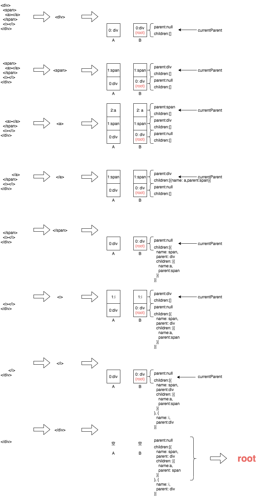

### 模板字符串编译成语法树

编译流程：

1. 编译过程中涉及两个数组`A[]`,`B[]`。
2. 解析模板字符串，当匹配到起始标签，将包含起始标签信息（名称、属性）的对象添加到`A`数组中，同时去除模板字符串中的匹配部分。
3. 根据起始标签信息创建语法树节点，语法树节点包含名称、属性、父节点、子节点（`children[]`）等信息，设置节点的父节点指向**当前父节点**(currentParent)，将语法树节点添加到添加到数组`B`中，同时设置节点为**当前父节点**。
4. 继续解析模板字符串，如果匹配到起始标签，继续步骤2。
5. 如果匹配到结束标签，找到刚添加到数组`B`中的节点（数组中的最后一个节点），并从数组`B`中移除，同时设置数组的最后一个节点为**当前父节点**，将找到的节点添加到**当前父节点**的子节点数组`children[]`中。
6. 找到最近添加到数组`A`中和结束标签名称相同的起始标签，并从数组`A`中移除。

> 通过数组`A[]`可以匹配开始标签对应的结束标签。通过数组`B[]`构建层级结构，形成语法树。

> 对数组的操作和栈一致，构建过程是一个深度遍历。

> 根节点指向第一个添加到数组`B`的节点，最后返回根节点。



### 语法树优化：静态节点标记

遍历语法树，标记语法树中的静态节点。根据之前的标记结果，再遍历标记静态根节点。在渲染时，对有标记静态根节点的子树进行缓存，下次渲染时直接从缓存中读取。

#### 怎么判断是静态节点

满足以下一个条件且子节点也都是静态节点就是：

1. 文本节点
2. 有pre属性的节点
3. 节点没有表达式；不是内建组件组件；没有动态绑定；没有if或者for，不是有for指令节点的子节点；节点上的属性都是静态属性。

```javascript
function isStatic (node) {
  if (node.type === 2) { // expression
    return false
  }
  if (node.type === 3) { // text
    return true
  }
  return !!(node.pre || (
    !node.hasBindings && // no dynamic bindings
    !node.if && !node.for && // not v-if or v-for or v-else
    !isBuiltInTag(node.tag) && // not a built-in 不是内建组件slot，component
    isPlatformReservedTag(node.tag) && // not a component 是原生标签
    !isDirectChildOfTemplateFor(node) &&// 不是有for指令的template标签的子标签
    Object.keys(node).every(isStaticKey)// 节点上的每个属性都是静态属性
  ))
}
```

#### 怎么判断是静态根节点

节点本身是静态节点，并且包含子节点，如果只有一个子节点，该子节点不能是纯文本节点（如果不满足这些条件做优化，成本将会超过它带来的价值）。

```javascript
 // For a node to qualify as a static root, it should have children that
    // are not just static text. Otherwise the cost of hoisting out will
    // outweigh the benefits and it's better off to just always render it fresh.
if (node.static && node.children.length && !(
      node.children.length === 1 &&// 1.静态节点（子节点都是静态节点），2. 包含子节点，3. 但又不是只有一个文本子节点
      node.children[0].type === 3
    )) {
      node.staticRoot = true;
      return
    } else {
      node.staticRoot = false;
    }
```

### 语法树转化成表达式字符串

遍历语法树，根据每个节点生成表达式字符串，然后拼接或者嵌套这些字符串，最后形成一个和语法树对应的完整的表达式字符串，渲染时通过with执行字符串中的表达式，生成虚拟节点树。


```javascript
function generate (
  ast,
  options
) {
  var state = new CodegenState(options);
  var code = ast ? genElement(ast, state) : '_c("div")';// 完整的表达式字符串
  return {
    render: ("with(this){return " + code + "}"),
    staticRenderFns: state.staticRenderFns// 保存了静态根节点子树生成的表达式字符串
  }
}
```

在遍历过程中，将有标记静态根节点的子树生成的表达式字符串保存到单独的数组中，完整的表达式字符串保存了静态子树表达式字符串在数组中的索引。

```javascript
function genStatic (el, state) {
  el.staticProcessed = true;
  var originalPreState = state.pre;
  if (el.pre) {
    state.pre = el.pre;
  }
  state.staticRenderFns.push(("with(this){return " + (genElement(el, state)) + "}"));
  state.pre = originalPreState;
  return ("_m(" + (state.staticRenderFns.length - 1) + (el.staticInFor ? ',true' : '') + ")")// 保存静态子树表达式字符串在数组中的索引
}
```