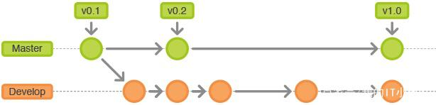
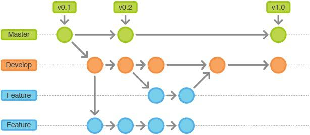
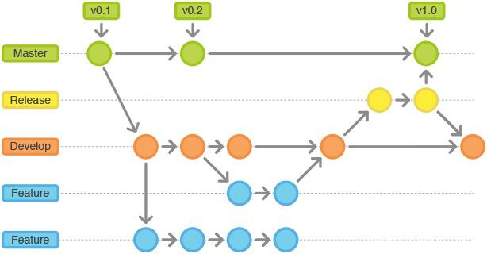
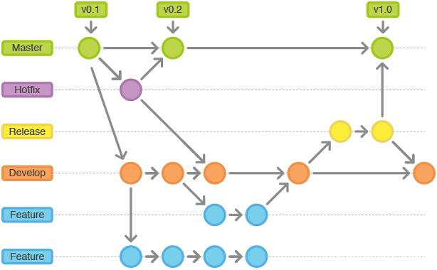

> 规范化管理代码库分支有助于版本库在演进过程中始终保持简洁，主干结构清晰。各个分支各司其职，有利于后续的维护更新，避免版本发布带来的混乱问题。

## 分支结构

### 主分支：master

- 用于部署生产环境的分支，需确保master分支稳定性，master分支存储了正式发布的历史。
- 属于只读分支，不能直接修改。**只能从其它分支（如develop，hotfix）合并**，
- 所有向master分支的Push推送都应当打TAG标签做记录，方便追溯。

### 开发分支：develop

- **基于master分支检出的分支**
- **只能从master以外的分支（如feature，hotfix）合并**
- develop分支始终保持最新完成以及bug修复后的代码

下为master和develop平行分支示意图：

### 功能分支：feature

- 用于新功能的开发
- **基于develop分支检出**
- **最终会被合并回develop**
- **命名规则：feature/*，如feature/shoppingcart，feature/userlogin**

下为feature分支应用示意图：

### 发布分支：release

- 用于准备发布新阶段版本，用于Bug测试及修复
- **基于develop分支检出，**
- **最终会先被合并到master（发布新版本），再被合并到develop**
- **命名规则：release/*，如release/1.0**

下为release分支应用示意图：

### 补丁分支：hotfix

- 用于对线上发布的版本进行BUG修复
- **基于master分支检出**，
- **最终会先被合并到master，再被合并到develop**
- **命名规则：hotfix/*，如hotfix/1.0.1**

下为hotfix分支应用示意图：

